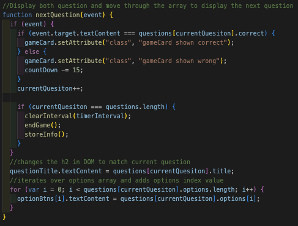

# Javascript_Quiz

## Goal

    The goal of this project was to test my javascript fundementals. Taking what I learned from in class and create an interactive quiz that will test the users knowdelge of the coding language Javascript. It will run thorugh a set of questions with multiple choice and notify the user if they had gotten it correct or incorrect. Finally, it will save the users score in the local storage and have a leaderboard to show the top winner.

## User Story

The given User Story is as follows:

    AS A coding boot camp student
    I WANT to take a timed quiz on JavaScript fundamentals that stores high scores
    SO THAT I can gauge my progress compared to my peers

## Acceptance Criteria

    GIVEN I am taking a code quiz
      * WHEN I click the start button
        THEN a timer starts and I am presented with a question
        *WHEN I answer a question
        THEN I am presented with another question
        *WHEN I answer a question incorrectly
        THEN time is subtracted from the clock
        *WHEN all questions are answered or the timer reaches 0
        THEN the game is over
        *WHEN the game is over
        THEN I can save my initials and score

## Given Example to Work From

## Puesdo Code

This was the steps I wrote out to begin taking on the acceptance criteria

### 1) What Data Do I need to track?

    -Wins and Losses stored in varibles
    -Scoreboard records in local storage

### 2) Where can I start?

    -Landing page with button to start the game (Use Html and CSS)
    -Set a title of what the game is and desctription of what the rules are using CSS

### 3) How can I build the questions?

    -build an array of objects and the keys of the object represent: Question, options, and thw anwser
    -event listener needs to be added to the options to than randmomly pick the next question

### 4) Timer

    -Timer needs run on if statements based around the user selecting the wrong option
    -Timer needs to stop at 0 and end the game
    -a form with filling for fillingout inials is displayed
    -Once timer is done, stats from the game are saved

### 5) Scoreboard

    -Scoreboard will store values in local storage

### 6) HTML

    -The HTML should coaitn h1
    -a header with link to scroeboard and timer set apart
    -The container for the questions to appear in

### 7) CSS

    -used to style the site

## Purpose of the Project

The main purpose of this project was to dive deep into the coding language of Javascript and build a fully interactive site for any user to use! Using Javascript to build a single page that would hide whole sections and change which section was displayed in just one click. Storing user inforamtion using the local storage built in the browers and using web API's to there full extent.

## Challenges

The biggest challenging momment for me was actually getting the questions array to display and move on to the next question. I had no idea at the start really how I was going to acomplish this task. I then sat back and decided to use the technique of puesdo coding to help me think through the actual process. It allowed me to come to a proper conculsion to use a for loop to run through the array and to trigger it with using an event listner to trigger the loop. Allowing it to run through the array and display a new question all in one click.

The Function I built to handle this task:

;

## Take Aways

This project had a lot of ups and downs for me as I spent a lot of time attempting to get javascript to interact in the way I was intending it to. Although it was a rather diffcult project for me, I did come out with more experience and deepth with the javascript language. I really enjoyed this project over all the frustration I felt during thr process. It was gratifying to see my final project up and running as intended!

## Links

This links to the live page:
https://mmount98.github.io/Javascript_Quiz/
